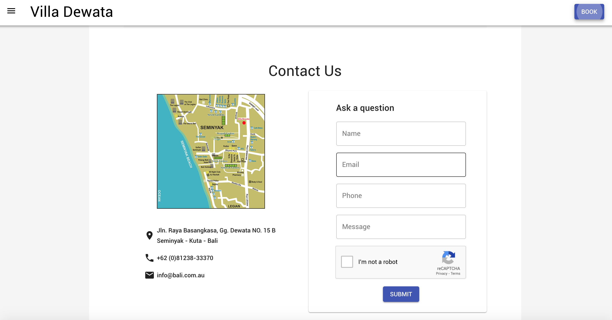
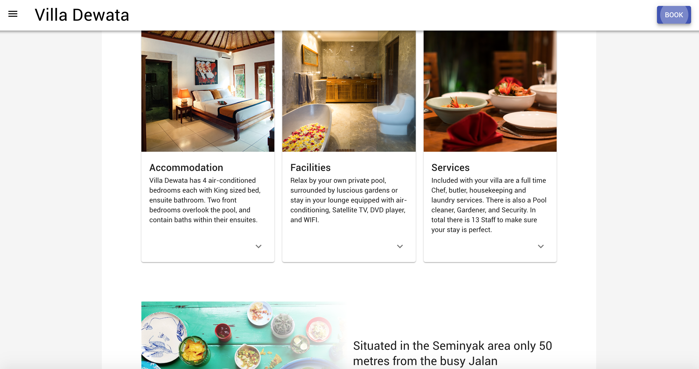
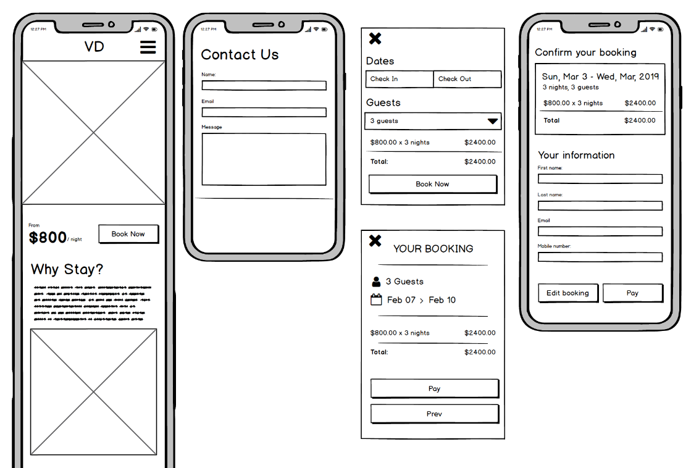
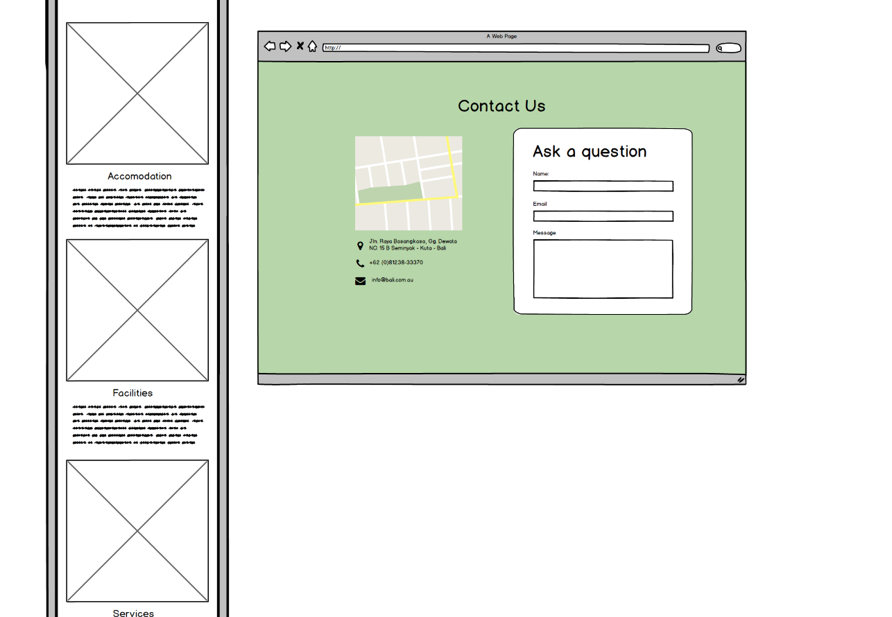

# README

# BALI.COM.AU

[Github](https://github.com/ImBlakeDoyle/js_final_assignment)
[AWS](http://bali-villa.s3-website-ap-southeast-2.amazonaws.com/)

---

## Description
### Problem definition/purpose
Replacing an old website for Bali hotel accommodation with a new and improved design, which includes a hotel booking system capable of calendar scheduling and payment processing and inquiry support.

### Functionality/features
1. Redesign of landing page
2. Hotel booking system
3. Admin panel to view and delete specific bookings
4. Inquiry form
5. Email verifications for hotel booking and inquiries

### Screenshots

### Tech stack
1. HTML, 
2. CSS, 
3. Material UI, 
4. React, 
5. Redux, 
6. Mongo, 
7. Express, 
8. Node, 
9. Heroku/AWS (Deployment)

### Instructions
Bali.com.au allows a user to book, search through available dates on the calendar without having an account, and finally input user information and then continue to stripe booking service. A user can also send an inquiry at the bottom of the page. 

---

## Design Documentation
### Design Process
The design process was based off similar applications. We drew inspiration from TripAdvisor and Airbnb. After looking through each website, we took bits and pieces that we liked from each and created wireframes based on those bits that we liked. We also leveraged content from the old bali.com.au website. 

### User Stories
* As a user, see the general overview.
* As a user, book/pay for the villa.
* As a user, see all the available facilities in depth.
* As a user, contact the owner.
* As a user, see images of the villa.
* As a user, see the available dates.
* As a user, know the total cost of a booking prior to confirmation.
* As a user, receive confirmation of booking via email.
* As an owner, have the calendar updated as bookings are made.
* As an owner, view the information of guests staying.
* As an owner, receive payments for each booking.
* As an owner, send of confirmation emails once a booking has been received.
* As an owner, charge different prices according to time of year.

### Wireframes

### Database Entity Relationship Diagrams
* Booking - (First name, Last name, Email, Guests, Checkin, Checkout, Phone, Comment, Cost, Dates )
* Inquiry - (Name, Email, Phone, Comment)
* User - (Email, Password)

---

## Details & planning
We contemplated a few clients and liked the bali.com.au one the best.
We then divided the work based on the team member's interest and area of strength. We decided to spend a day or half on exploring the area we are working on (reading materials or watching class videos).

We divided the time line to get the work done. Every day standups where very handy to get updated on team member's work. All of us finished what we initially promised on the timeline.

---

## Short Answer

>>1. What are the most important aspects of quality software?

1. Planning proper structure of the app using story boarding, 
2. User flows, and wireframes, 
3. Followed by database design including entity relationship diagrams etc. 
4. Pair programming can be utilized during the coding phase to enhance code quality.
5. Validation of form data 
6. Test driven development with good code coverage should also be a focus.

>> 2. What libraries are being used in the app and why?

1. React – front end library/framework enabling incorporation of javascript, jsx, components into web development, 
2. Redux – state management enabling storing data across the app, 
3. Material UI –enabling easier application of design/styling within html and css, 
4. Express – enabling effective/ease of routing throughout the application
5. Mongoose – database that holds data for the application, 
6. Sendgrip – enabling email within the application, 
7. Stripe – enabling payments within the application , 
8. Jest – enabling testing within the app

>>3. A team is about to engage in a project, developing a website for a small business. What knowledge and skills would they need in order to develop the project?

1. Good communication skills 
2. Project planning/product management skills 
3. UI/UX skills 
4. Front-end development 
5. Back-end development 
6. QA/Testing skills
7. Documentation

>>4. Within your own project what knowledge or skills were required to complete your project, and overcome challenges? 

1. Expectation setting with client
2. UI/UX/Story boarding on feature set
3.  Effective task management between team leveraging skill-set of each team member
4. Leveraging self-learning / resources to solve problems (from class lessons and guides, past projects, google and forums)
5. Leveraging senior devs/instructors help to progress during 
6. Balance of front-end and back-end development skills
7. Test driven development skills
 

>>5. Evaluate how effective your knowledge and skills were this project, using examples, and suggest changes or improvements for future projects of a similar nature? 

Skills and understanding improved throughout the project, particularly in react and redux (understanding the use-cases for redux and benefits of it) material UI, how the back-end ties into the front-end, and testing.
